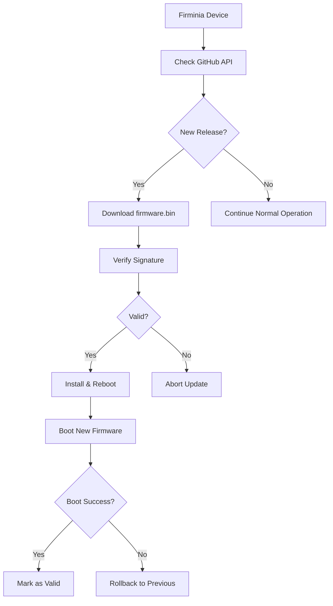

# 🚀 Firminia GitHub Releases OTA Guide

## Overview

This guide explains how to use GitHub Releases for Firminia's Over-The-Air (OTA) firmware updates.

## 📦 GitHub Releases Structure

### Release URL Pattern
```
https://github.com/bisontebiscottato/firminia3/releases/download/{version}/firminia3.bin
```

Example: https://github.com/bisontebiscottato/firminia3/releases/download/3.5.2/firminia3.bin

### Required Files per Release

Each GitHub release should contain:

1. **`firminia3.bin`** - Main firmware binary (signed)
2. **`firminia3.sig`** - RSA signature file (optional, for enhanced security)
3. **`CHANGELOG.md`** - Release notes and changes
4. **`manifest.json`** - Optional metadata file

## 🔄 OTA Update Flow



## 🛠️ Creating a Release

### 1. Prepare Firmware Binary

```bash
# Build firmware
idf.py build

# Copy binary to release folder
cp build/firminia3.bin release/firminia3.bin

# Optional: Sign firmware for production
espsecure.py sign_data --keyfile signing_key.pem \
    --output release/firminia3.bin \
    build/firminia3.bin

# Generate signature file
openssl dgst -sha256 -sign signing_key.pem \
    -out release/firminia3.sig \
    release/firminia3.bin
```

### 2. Create GitHub Release

#### Via GitHub Web Interface:
1. Go to https://github.com/bisontebiscottato/firminia3/releases
2. Click "Create a new release"
3. Tag version: `3.5.2` (follow semantic versioning)
4. Release title: `Firminia v3.5.2 - QR Code Improvements`
5. Describe changes in release notes
6. Upload files:
   - `firminia3.bin`
   - `firminia3.sig` (optional)
   - Any additional documentation

#### Via GitHub CLI:
```bash
# Create release with files
gh release create 3.5.2 \
    --title "Firminia v3.5.2 - QR Code Improvements" \
    --notes-file CHANGELOG.md \
    release/firminia3.bin \
    release/firminia3.sig
```

## 🔍 GitHub API Integration

### API Endpoint Used
```
GET https://api.github.com/repos/bisontebiscottato/firminia3/releases/latest
```

### Response Format
```json
{
  "tag_name": "3.5.2",
  "name": "Firminia v3.5.2 - QR Code Improvements",
  "published_at": "2025-09-10T10:30:00Z",
  "assets": [
    {
      "name": "firminia3.bin",
      "size": 1887436,
      "browser_download_url": "https://github.com/bisontebiscottato/firminia3/releases/download/3.5.2/firminia3.bin"
    },
    {
      "name": "firminia3.sig",
      "size": 256,
      "browser_download_url": "https://github.com/bisontebiscottato/firminia3/releases/download/3.5.2/firminia3.sig"
    }
  ]
}
```

## 🔧 Firminia Configuration

### Version Comparison
- Current version: `3.5.2`
- Latest release: `3.5.2`
- Update available: `strcmp("3.5.2", "3.5.2") < 0` → **true**

### Update Process
1. **Check**: GitHub API call every 6 hours
2. **Compare**: Semantic version comparison
3. **Download**: Direct from GitHub CDN
4. **Verify**: Optional signature verification
5. **Install**: Write to OTA partition
6. **Reboot**: Switch to new firmware

## 📊 Benefits of GitHub Releases

| Feature | Benefit |
|---------|---------|
| **Global CDN** | Fast downloads worldwide |
| **Version Control** | Automatic versioning and history |
| **Release Notes** | Changelog integrated with releases |
| **Asset Management** | Multiple files per release |
| **API Access** | Programmatic release checking |
| **Free Hosting** | No additional infrastructure costs |
| **HTTPS Native** | Secure downloads by default |
| **Download Stats** | Track adoption metrics |

## 🔒 Security Considerations

### 1. Firmware Signing
```bash
# Production signing process
espsecure.py sign_data --keyfile production_key.pem \
    --output firminia3_signed.bin \
    firminia3.bin
```

### 2. Signature Verification
The OTA system can verify RSA signatures:
- Public key embedded in firmware
- Signature downloaded alongside binary
- Verification before installation

### 3. HTTPS Transport
- All downloads use HTTPS
- GitHub's SSL certificates
- Man-in-the-middle protection

## 📈 Monitoring & Analytics

### GitHub Insights
- Download statistics per release
- Geographic distribution
- Adoption rate tracking

### Device Telemetry
```c
ESP_LOGI(TAG, "📊 OTA Stats:");
ESP_LOGI(TAG, "  Current: %s", CURRENT_VERSION);
ESP_LOGI(TAG, "  Updated: %s", new_version);
ESP_LOGI(TAG, "  Size: %lu bytes", download_size);
ESP_LOGI(TAG, "  Duration: %lu ms", update_duration);
```

## 🧪 Testing Strategy

### 1. Development Testing
```bash
# Create test release
gh release create 3.5.2-beta \
    --prerelease \
    --title "Beta Test Release" \
    firminia3.bin
```

### 2. Gradual Rollout
- Use pre-releases for testing
- Monitor device logs
- Gradual promotion to full release

### 3. Rollback Strategy
- Keep previous firmware available
- Automatic rollback on boot failure
- Manual rollback capability

## 🚨 Emergency Procedures

### Hotfix Release
```bash
# Quick hotfix for critical issues
idf.py build
gh release create 3.5.2-hotfix \
    --title "Critical Security Fix" \
    --notes "Fixes critical security vulnerability CVE-2024-XXXX" \
    build/firminia3.bin
```

### Rollback Release
If a release causes issues:
1. Create new release with previous working firmware
2. Increment version number (3.5.3 with 3.5.2 firmware)
3. Document rollback in release notes

## 📞 Support

For issues with GitHub OTA:
- Check GitHub API rate limits
- Verify release assets are properly uploaded
- Monitor device logs during updates
- Test with development releases first

---

**🎯 Best Practice**: Always test OTA updates with beta releases before promoting to production!
