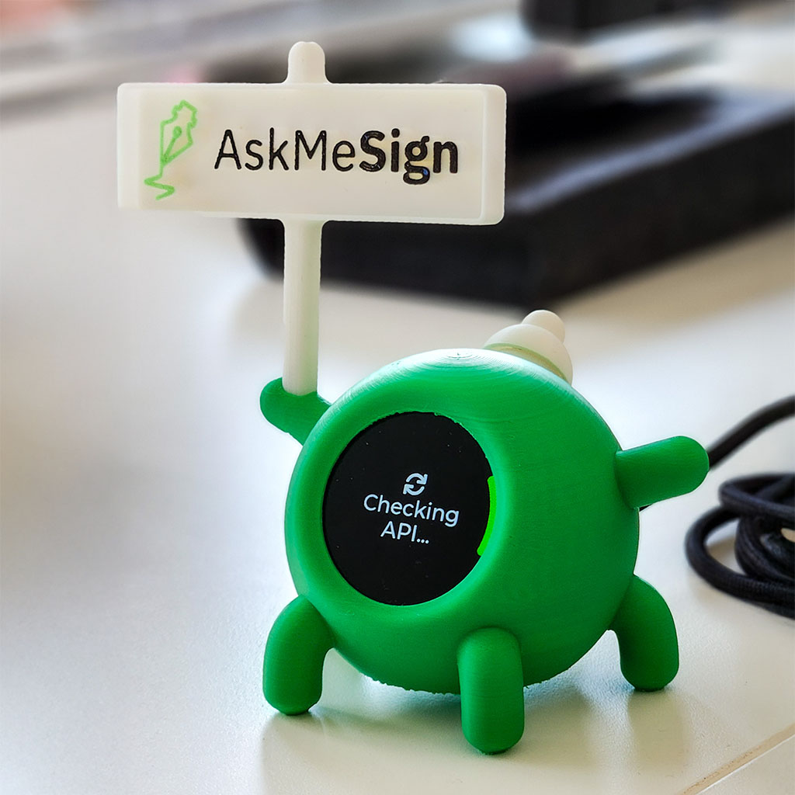
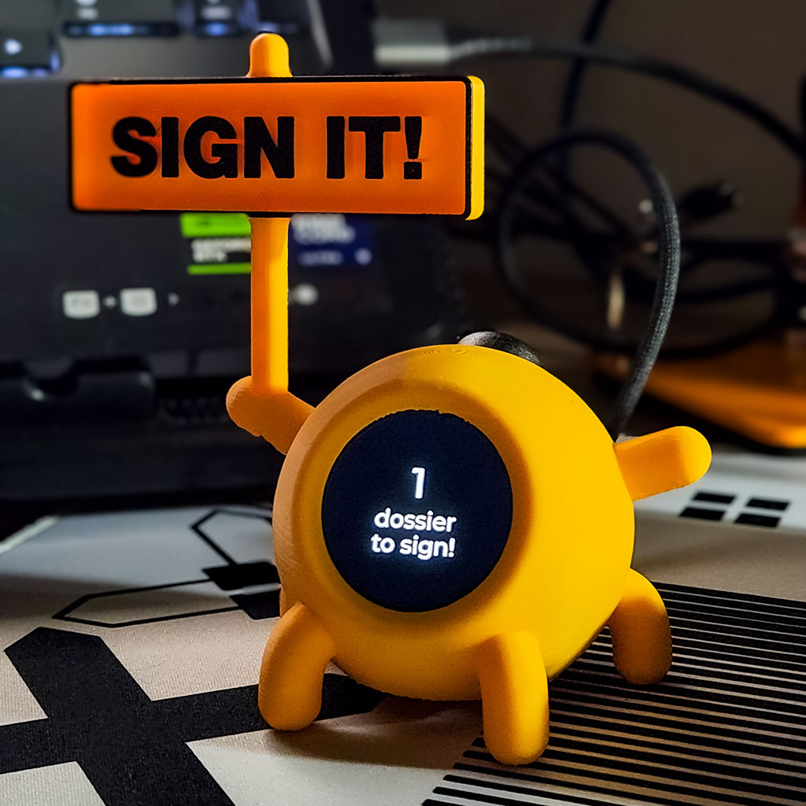
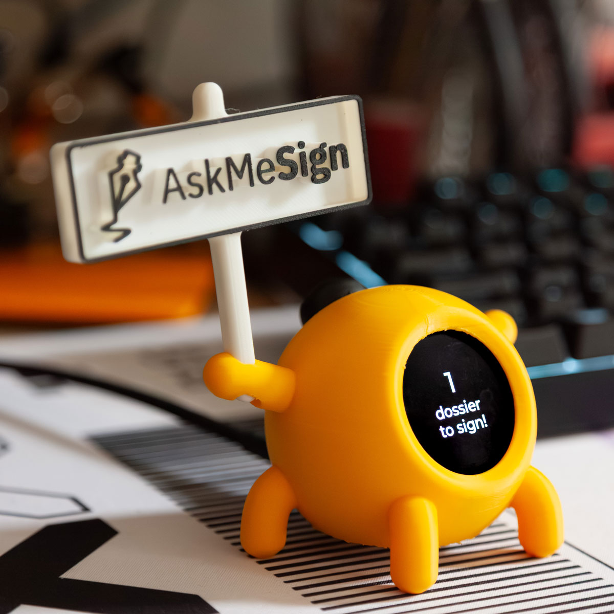

# Firminia – Your Personal Assistant for Digital Signature Activities with AskMeSign

[](https://docs.espressif.com/projects/esp-idf/en/latest/esp32/)
[](https://lvgl.io/)
[](LICENSE.md)

Firminia is a powerful, yet easy-to-use embedded solution designed to streamline your digital signing workflow using the AskMeSign platform. Leveraging BLE and Wi-Fi connectivity, Firminia displays pending documents and their status directly on a compact and efficient LCD display.

## 📸 Firminia V3 Gallery

<div align="center">
  
  
  
</div>

*Firminia V3 - Your personal assistant for digital signature activities*

## 📋 Table of Contents

- [Features](#-features)
- [Hardware Requirements](#-hardware-requirements)
- [3D Printing](#️-3d-printing)
- [Software Requirements](#-software-requirements)
- [Quick Start](#-quick-start)
- [Installation](#-installation)
- [Configuration](#-configuration)
- [API Integration](#-api-integration)
- [Project Structure](#-project-structure)
- [Building and Flashing](#-building-and-flashing)
- [Usage](#-usage)
- [Troubleshooting](#-troubleshooting)
- [Contributing](#-contributing)
- [License](#-license)

## ✨ Features

- **📱 Bluetooth Configuration**: Easy setup via BLE with dedicated React app
- **📡 Wi-Fi Integration**: Automatic connection to AskMeSign API
- **📊 Real-time Display**: Shows pending document count on round LCD
- **⚡ Low Power**: Efficient ESP32-S3 implementation
- **🔧 JSON Configuration**: Flexible setup via JSON payload
- **🔄 Auto-reconnection**: Robust Wi-Fi and API connection handling
- **📱 Mobile App**: Dedicated React TypeScript configuration interface
- **🌍 Multi-language Support**: Interface available in English, Italian, French, and Spanish
- **🔒 Secure Configuration**: No sensitive data stored in firmware
- **🔵 Auto BLE Mode**: Automatically enters configuration mode when default settings detected
- **🔄 Configuration Reset**: Hold button for 5 seconds to reset configuration to defaults

## 🔧 Hardware Requirements

- **ESP32 Development Board:** [Seeed XIAO Esp32-S3](https://www.seeedstudio.com/Seeed-XIAO-ESP32C3-p-5431.html)
- **Display:** Waveshare [1.28-inch Round LCD Module](https://www.waveshare.com/1.28inch-lcd-module.htm), 240×240 pixels, 65K RGB
- **Push Button:** [Normally-open switch](https://it.aliexpress.com/item/1005008849196960.html) for initiating BLE advertising mode and forcing check 
- **USB-C Cable:** For powering and programming the ESP32

## 🖨️ 3D Printing

Firminia V3 comes with a custom 3D-printed case designed for optimal component placement and professional appearance.

### 3D Model Files

- **[FirminiaV3.3mf](support-data/3D print files/FirminiaV3.3mf)** - Complete 3D model for printing the case


## 💻 Software Requirements

- **ESP-IDF Framework:** Version 5.4+ recommended
- **LVGL Library:** For display management and animations
- **Git:** For cloning the repository
- **Python 3.7+:** Required for ESP-IDF build system

## 🚀 Quick Start

1. **Clone the repository:**
   ```bash
   git clone https://github.com/your-username/firminia3.git
   cd firminia3
   ```

2. **Set up ESP-IDF:**
   ```bash
   # Follow ESP-IDF installation guide
   # https://docs.espressif.com/projects/esp-idf/en/latest/esp32/get-started/
   ```

3. **Build and flash:**
   ```bash
   idf.py set-target esp32s3
   idf.py build
   idf.py -p /dev/YOUR_SERIAL_PORT flash monitor
   ```

4. **Configure via Bluetooth:**
   - Press the button to enable BLE advertising
   - Use the [Firminia React App](https://github.com/bisontebiscottato/firminia3-react-app) to configure

## 📦 Installation

### Prerequisites

1. **Install ESP-IDF:**
   ```bash
   # Download and install ESP-IDF v5.4+
   # Follow: https://docs.espressif.com/projects/esp-idf/en/latest/esp32/get-started/
   ```

2. **Set up your development environment:**
   ```bash
   # Source ESP-IDF environment
   . $HOME/esp/esp-idf/export.sh
   ```

3. **Install dependencies:**
   ```bash
   # Dependencies are managed via idf_component.yml
   idf.py reconfigure
   ```

## ⚙️ Configuration

### JSON Configuration via BLE

Configure Firminia easily using the following JSON structure sent through a BLE app:

```json
{
    "ssid": "your_wifi_ssid",
    "password": "your_wifi_password",
    "server": "sign.askme.it",
    "port": "443",
    "url": "https://sign.askme.it/api/v2/files/pending?page=0&size=1",
    "token": "your_api_token",
    "user": "your_user_identifier",
    "interval": "30000",
    "language": "0"
}
```

### React TypeScript Configuration App

Firminia can be configured via Bluetooth using a dedicated React TypeScript application:

**[Firminia React App](https://github.com/bisontebiscottato/firminia3-react-app)**

This application provides a user-friendly interface for configuring Firminia's settings via Bluetooth Low Energy (BLE) communication, making the initial setup process much more convenient than using a generic BLE scanner.

### Configuration Parameters

| Parameter | Description | Example |
|-----------|-------------|---------|
| `ssid` | Wi-Fi network name | "MyWiFi" |
| `password` | Wi-Fi password | "mypassword123" |
| `server` | AskMeSign server domain | "sign.askme.it" |
| `port` | HTTPS port (usually 443) | "443" |
| `url` | API endpoint for pending documents | "https://sign.askme.it/api/v2/files/pending?page=0&size=1" |
| `token` | Your API authentication token | "your_token_here" |
| `user` | User identifier | "user123" |
| `interval` | Polling interval in milliseconds | "30000" |
| `language` | Interface language (0=EN, 1=IT, 2=FR, 3=ES) | "0" |

## 🌍 Multi-language Support

Firminia V3 supports multiple languages for the user interface. The language can be configured via BLE using the `language` parameter in the JSON configuration.

### Supported Languages

- **0** - English (Default)
- **1** - Italiano
- **2** - Francais
- **3** - Espanol

### Language Configuration

Add the `language` parameter to your JSON configuration:

```json
{
    "ssid": "your_wifi_ssid",
    "password": "your_wifi_password",
    "server": "sign.askme.it",
    "port": "443",
    "url": "https://sign.askme.it/api/v2/files/pending?page=0&size=1",
    "token": "your_api_token",
    "user": "your_user_identifier",
    "interval": "30000",
    "language": "1"
}
```

For detailed information about the localization system, see [LANGUAGE_SUPPORT.md](LANGUAGE_SUPPORT.md).

## 🔒 Security & Configuration Management

### Secure Configuration
Firminia V3 implements secure configuration practices:

- **No Hardcoded Credentials**: No sensitive data (Wi-Fi passwords, API tokens, user emails) stored in firmware
- **Default Configuration Detection**: Automatically detects when using default/empty configuration
- **Automatic BLE Mode**: Enters configuration mode automatically when default settings are detected
- **Configuration Validation**: Validates all configuration parameters before saving

### Configuration Reset Feature

Firminia V3 includes a built-in configuration reset mechanism for easy maintenance:

#### How to Reset Configuration
1. **During any operational state** (except initial warm-up)
2. **Hold the button for 5 seconds continuously**
3. **System will show progress** in logs every second
4. **Automatic restart** after reset completion
5. **Enters BLE mode** automatically for reconfiguration

#### When Reset is Available
- ✅ **BLE Configuration Mode**
- ✅ **Wi-Fi Connection States**  
- ✅ **API Checking States**
- ✅ **Display States** (showing/no practices)
- ✅ **Error States**
- ❌ **Warm-up Phase** (excluded for safety)

### First Boot Behavior

#### New Device (Default Configuration)
```
Power On → Warm-up → Load Config → Default Detected → Auto BLE Mode → Wait for Configuration
```

#### Configured Device
```
Power On → Warm-up → Load Config → Valid Config → Connect Wi-Fi → Normal Operation
```

#### Manual Configuration Mode
```
Power On → Warm-up → Button Press → BLE Mode → Wait for Configuration
```

## 🔌 API Integration

Firminia integrates seamlessly with the AskMeSign REST API:

- **API Documentation:** [AskMeSign Swagger UI](https://sign.askme.it/swagger-ui.html#/)
- **Supported Actions:** Fetching the count of pending documents to sign.
- **Authentication:** Token-based authentication
- **Polling:** Configurable interval for API requests

## 📁 Project Structure

```
firminia3/
├── main/
│   ├── main_flow.c          # Central logic and state management
│   ├── api_manager.c        # HTTPS requests and JSON parsing
│   ├── ble_manager.c        # BLE GATT services implementation
│   ├── device_config.c      # NVS configuration storage
│   ├── display_manager.c    # LVGL UI and animations
│   └── wifi_manager.c       # Wi-Fi connection handling
├── CMakeLists.txt           # Main build configuration
├── idf_component.yml        # Component dependencies
├── partitions.csv           # ESP32 partition table
└── sdkconfig               # ESP-IDF configuration
```

### Core Components

- **`main_flow.c`**: Central logic controlling device states, Wi-Fi connectivity, BLE handling, and periodic API calls.
- **`api_manager.c`**: Manages HTTPS requests to the AskMeSign API, JSON response parsing, and error handling.
- **`ble_manager.c`**: Implements BLE GATT services allowing JSON-based configuration through a smartphone.
- **`device_config.c`**: Stores and retrieves device configuration (Wi-Fi credentials, API endpoints, user tokens) using NVS.
- **`display_manager.c`**: Controls LVGL-based user interface, handles animations, status indicators, and pending document count display.
- **`wifi_manager.c`**: Handles Wi-Fi initialization, connection logic, and reconnection events.

## 🔨 Building and Flashing

### Build Commands

```bash
# Set target and build
idf.py set-target esp32s3
idf.py build

# Flash to device
idf.py -p /dev/YOUR_SERIAL_PORT flash

# Monitor serial output
idf.py -p /dev/YOUR_SERIAL_PORT monitor

# Build, flash, and monitor in one command
idf.py -p /dev/YOUR_SERIAL_PORT flash monitor
```

### Serial Port Examples

- **Windows:** `COM3`, `COM4`, etc.
- **Linux:** `/dev/ttyUSB0`, `/dev/ttyACM0`
- **macOS:** `/dev/cu.usbserial-*`

## 📱 Usage

### Initial Setup (New Device)

1. **Power on the device** and wait for warm-up phase
2. **Device automatically enters BLE mode** when default configuration is detected
3. **Connect via Bluetooth** using the [React app](https://github.com/bisontebiscottato/firminia3-react-app) or BLE scanner
4. **Send configuration JSON** with your Wi-Fi and API credentials
5. **Device automatically restarts** and begins normal operation
6. **Verify connection** - the display should show connection status

### Manual Configuration Mode

1. **During warm-up phase**, press and release the button
2. **BLE advertising starts** for 2 minutes
3. **Connect and configure** as described above
4. **Device restarts** after receiving valid configuration

### Configuration Reset

1. **During normal operation**, hold the button for 5 seconds
2. **Watch progress logs** - device shows countdown
3. **Configuration resets** to defaults automatically
4. **Device restarts** and enters BLE mode for reconfiguration

### Normal Operation

- **Automatic polling:** Device checks for pending documents every 30 seconds (configurable)
- **Display updates:** Round LCD shows current pending document count
- **Status indicators:** Visual feedback for connection and error states
- **Auto-reconnection:** Automatic Wi-Fi and API reconnection on failures
- **Button functions:**
  - **Short press during warmup:** Enter BLE configuration mode
  - **Hold for 5 seconds (anytime):** Reset configuration to defaults


## 🔧 Troubleshooting

### Common Issues

| Issue | Solution |
|-------|----------|
| **Device stuck in BLE mode** | Check configuration JSON format, ensure all required fields are present |
| **Wi-Fi connection fails** | Verify SSID/password in configuration JSON, try configuration reset |
| **BLE not advertising** | Press button again, check button wiring, or wait for auto-BLE mode |
| **API requests failing** | Verify token and server URL, check network connectivity |
| **Display not working** | Check SPI connections, verify GC9A01 driver |
| **Build errors** | Ensure ESP-IDF v5.4+, run `idf.py clean` |
| **Configuration reset not working** | Ensure button is held for full 5 seconds, check button wiring |
| **Device won't enter BLE mode** | Try configuration reset (hold button 5 seconds) to force BLE mode |

### Debug Commands

```bash
# Monitor serial output for debugging
idf.py monitor

# Clean build
idf.py clean

# Reconfigure project
idf.py reconfigure

# Check component dependencies
idf.py dependencies
```

### Serial Log Levels

```bash
# Enable verbose logging
idf.py menuconfig
# Navigate to Component config → Log output → Default log verbosity → Debug
```

## 🤝 Contributing

We welcome contributions! Please follow these steps:

1. **Fork the repository**
2. **Create a feature branch:** `git checkout -b feature/amazing-feature`
3. **Commit your changes:** `git commit -m 'Add amazing feature'`
4. **Push to the branch:** `git push origin feature/amazing-feature`
5. **Open a Pull Request**

### Development Setup

```bash
# Clone your fork
git clone https://github.com/your-username/firminia3.git
cd firminia3

# Add upstream remote
git remote add upstream https://github.com/original-owner/firminia3.git

# Create development branch
git checkout -b develop
```

## 📄 License

This project is licensed under the MIT License - see the [LICENSE.md](LICENSE.md) file for details.

---

**Made with ❤️ by Andrea Mancini**
